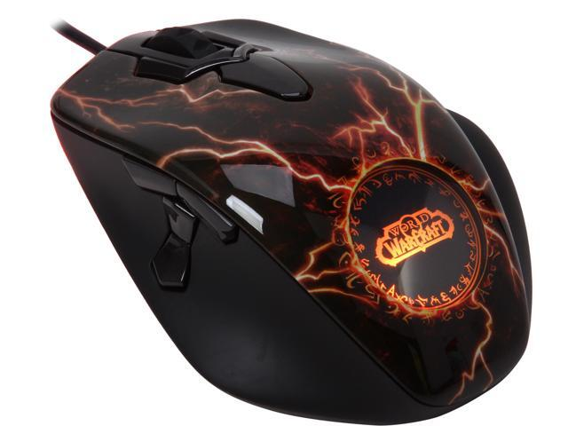

# SteelSeries World Warcraft Legendary MMO Gaming Mouse - macOS Driver



[Product description](https://www.techpowerup.com/150306/steelseries-announces-world-of-warcraft-legendary-edition-gaming-mouse)

SteelSeries never released a macOS driver for this mouse, and generic HID
remappers (e.g. [Mac Mouse Fix](https://macmousefix.com/)) only pick up the
5 standard buttons (left/right/middle/back/forward). The rest of the buttons
are exposed on a **vendor-defined HID interface** (usage page `0xFF00`)
instead of the standard Button usage page, which is why generic tools can't
see them.

> Note: macOS identifies the device as `World of Warcraft MMO Gaming
> Mouse:Maelstrom Edition` (USB `1038:1310`), an earlier Cataclysm-era
> revision, not the "Legendary Edition" branding some retailers use. The
> button layout below was reverse-engineered against that specific unit.

This repo has two things:

- **`Driver/`** - a small background daemon that reads the extra buttons and
  turns each one into a keystroke (or a shell command) of your choosing.
- **`tools/hidmonitor.swift`** - the diagnostic tool used to reverse-engineer
  the button layout in the first place. Useful if you have a different
  revision of this mouse and need to remap the bit table.

## Button map

| Button | HID interface | Byte.Bit |
|---|---|---|
| Left click | standard | byte0.0 |
| Right click | standard | byte0.1 |
| Wheel click | standard | byte0.2 |
| Thumb Backward | standard | byte0.3 |
| Thumb Forward | standard | byte0.4 |
| Thumb Down | vendor (`0xFF00`) | byte0.2 |
| Thumb Up | vendor (`0xFF00`) | byte0.3 |
| Pinky (right side) | vendor (`0xFF00`) | byte0.4 |
| Left of wheel | vendor (`0xFF00`) | byte0.6 |
| Right of wheel | vendor (`0xFF00`) | byte0.7 |
| Behind wheel | vendor (`0xFF00`) | byte1.0 |

Left/right click always work as ordinary clicks (macOS handles those
natively). The other 9 are configurable through `config.json` (see below) -
the standard-interface 3 (wheel click, thumb forward/backward) default to no
extra action, since macOS already delivers them as ordinary mouse buttons;
the 6 vendor-only ones default to typing `1`-`6`.

## Install

Requires Xcode Command Line Tools (`xcode-select --install`).

```bash
cd Driver
./install.sh
```

You'll be asked whether the driver should start automatically at login and
keep running in the background (recommended for daily use), or whether
you'd rather start it manually each time. You can answer non-interactively
with `./install.sh --login` or `./install.sh --no-login`.

The first time it runs, **macOS will prompt for Accessibility permission**
(needed to send the synthesized keystrokes). If you miss the prompt, grant
it manually: **System Settings -> Privacy & Security -> Accessibility**, add
your terminal app (or the `wowmousedriverd` binary), then restart the
driver.

To run it manually instead of installing a LaunchAgent:

```bash
"$HOME/Library/Application Support/SteelSeriesWowMouseDriver/wowmousedriverd"
```

## Configuring buttons

Edit `~/Library/Application Support/SteelSeriesWowMouseDriver/config.json`.
Changes are picked up immediately - no need to restart the driver.

```json
{
  "thumbUp": { "key": "2" },
  "pinky": { "shell": "open -a Safari" },
  "wheelClick": { "key": "cmd+shift+4" }
}
```

Each button takes either:
- `"key"` - a key name, optionally with modifiers (`cmd`, `shift`, `opt`,
  `ctrl`), e.g. `"1"`, `"f13"`, `"cmd+c"`.
- `"shell"` - a shell command to run on press (via `zsh -c`), e.g. to launch
  an app or run an AppleScript.

Button names: `thumbUp`, `thumbDown`, `pinky`, `leftOfWheel`, `rightOfWheel`,
`behindWheel`, `wheelClick`, `thumbForward`, `thumbBackward`.

## Uninstall

```bash
cd Driver
./uninstall.sh
```

This stops the LaunchAgent and removes it, leaving `config.json` in place.

## Diagnosing a different mouse revision

If your unit reports different button codes, use the diagnostic tool to
find them:

```bash
cd tools
swiftc -O hidmonitor.swift -o hidmonitor
./hidmonitor 0xFF00 1   # vendor interface only
./hidmonitor            # all interfaces
```

Press a button and watch for a `DIFF: byte[N] ...` line - that tells you
which byte/bit to add to the `buttons` table in `Driver/main.swift`.
